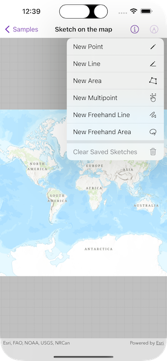

# Sketch on the map

Use the Geometry Editor to edit or sketch a new point, line, or polygon geometry on a map.

## Use case

A field worker could annotate features of interest on a map (via the GUI) such as location of dwellings (marked as points), geological features (polylines), or areas of glaciation (polygons).

## How to use the sample

Tap the pencil button to choose a geometry editor tool. Begin interactively sketching on the map view. Tap the pencil button again for editing options or to save or cancel a sketch.

## How it works

1. Create an `GeometryEditor` and assign it to a map view with the `geometryEditor` view modifier.
2. Set the tool of the geometry editor to the preferred tool.
3. Use the `start(withType:)` method on the `GeometryEditor` to start interactively sketching on the map view.
4. Use various methods and properties of the `GeometryEditor` to undo, redo, delete a selected element, clear the sketch, and cancel the sketch. 
5. Save a sketch as a `Graphic` to a `GraphicsOverlay` displayed on the map view.

## Relevant API

* MapView
* GeometryEditor
* Geometry
* Graphic
* GraphicsOverlay
* GeometryBuilder

## Tags

draw, edit, sketch
