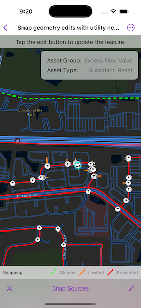

# Snap geometry edits with utility network rules

Use the Geometry Editor to edit geometries using utility network connectivity rules.

## Use case

A field worker can create new features in a utility network by editing and snapping the vertices of a geometry to existing features on a map. In a gas utility network, gas pipeline features can be represented with the polyline geometry type. Utility networks use geometric coincident-based connectivity to provide pathways for resources. Rule-based snapping uses utility network connectivity rules when editing features based on their asset type and asset group to help maintain network connectivity.

## How to use the sample

To edit a geometry, tap a feature on the map to select it and press the edit button to start the geometry editor.

Tap the "Snap Sources" button to view and enable/disable the snap sources. To interactively snap a vertex to a feature or graphic, ensure that snapping is enabled for the relevant snap source, then drag a vertex to nearby an existing feature or graphic. If the existing feature or graphic has valid utility network connectivity rules for the asset type that is being created or edited, the edit position will be adjusted to coincide with (or snap to) edges and vertices of its geometry. Tap to place the vertex at the snapped location. Snapping will not occur when `SnapRuleBehavior.rulesPreventSnapping` is `true`, even when the source is enabled.

To discard changes and stop the geometry editor, press the Cancel (X) button. To save your edits, press the Save (✔️) button.

## How it works

1. Create a map and use its `loadSettings` to set `featureTilingMode` to `enabledWithFullResolutionWhenSupported`.
2. Create a `Geodatabase` using the mobile geodatabase file location.
3. Display `Geodatabase.featureTables` on the map using subtype feature layers.
4. Create a `GeometryEditor` and connect it to a `MapView`.
5. When editing a feature:
    1. Create a `UtilityAssetType` for the feature with `UtilityNetwork.makeElement(arcGISFeature:terminal:)` using the utility network from the geodatabase.
    2. Call `SnapRules.rules(for:assetType:)` to get the snap rules associated with the utility asset type.
    3. Use `SnapSettings.syncSourceSettings(rules:sourceEnablingBehavior:)` passing in the snap rules and `SnapSourceEnablingBehavior.setFromRules` to populate the `SnapSettings.sourceSettings` with `SnapSourceSettings`.
6. Start the geometry editor with the feature's geometry or a `Point` geometry type.

## Relevant API

* FeatureLayer
* Geometry
* GeometryEditor
* GeometryEditorStyle
* GraphicsOverlay
* MapView
* SnapRuleBehavior
* SnapRules
* SnapSettings
* SnapSource
* SnapSourceEnablingBehavior
* SnapSourceSettings
* UtilityNetwork

## About the data

This sample downloads the [NapervilleGasUtilities](https://www.arcgis.com/home/item.html?id=0fd3a39660d54c12b05d5f81f207dffd) item from *ArcGIS Online* automatically. The Naperville gas utilities mobile geodatabase contains a utility network with a set of connectivity rules that can be used to perform geometry edits with rule-based snapping.

## Tags

edit, feature, geometry editor, graphics, layers, map, snapping, utility network
