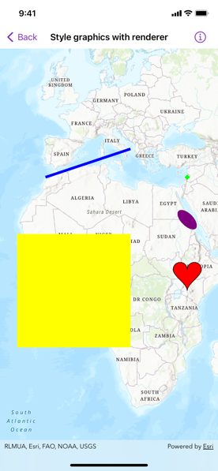

# Style graphics with renderer

A renderer allows you to change the style of all graphics in a graphics overlay by referencing a single symbol style. A renderer will only affect graphics that do not specify their own symbol style.

## Use case

A renderer allows you to change the style of all graphics in an overlay by only changing one copy of the symbol. For example, a user may wish to display a number of graphics on a map of parkland which represent trees, all sharing a common symbol.

## How to use the sample

Pan and zoom on the map to view graphics for points, lines, and polygons (including polygons with curve segments), which are stylized using renderers.

## How it works

1. Create a `Graphic`, specifying only a `Geometry`.
2. Create a `GraphicsOverlay` with the graphic.
3. Create a `Symbol` such as a `SimpleMarkerSymbol`.
4. Create a renderer with `SimpleRenderer(symbol:)`, passing in a `Symbol`.
5. Set the renderer for the graphics overlay.

## Relevant API

* CubicBezierSegment
* EllipticArcSegment
* GeodesicEllipseParameters
* Geometry
* Graphic
* GraphicsOverlay
* MutablePart
* Polygon
* Polyline
* SimpleFillSymbol
* SimpleLineSymbol
* SimpleMarkerSymbol
* SimpleRenderer
* static GeometryEngine.geodesicEllipse(parameters:)

## Additional information

To set unique symbols across a number of graphics (e.g. showing graphics of individual landmarks), see "Style graphics with symbols" sample.

## Tags

arc, bezier, curve, display, ellipse, graphics, marker, overlay, renderer, segment, symbol, true curve
