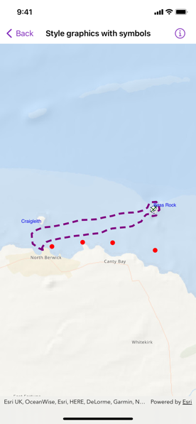

# Style graphics with symbols

Use a symbol style to display a graphic on a graphics overlay.

## Use case

Allows you to customize a graphic by assigning a unique symbol. For example, you may wish to display individual graphics for different landmarks across a region, and to style each one with a unique symbol.

## How to use the sample

Pan and zoom around the map. Observe the graphics on the map.

## How it works

1. Create a `GraphicsOverlay` object.
2. Create an instance of a `Symbol` subclass, such as `SimpleFillSymbol`, `SimpleLineSymbol`, `SimpleMarkerSymbol`, or `TextSymbol`.
3. Create a `Graphic` instance, specifying a `Geometry`, attributes, and a `Symbol`.
4. Add the graphic to the graphics overlay.
5. Create a `MapView` instance with the graphics overlay.

## Relevant API

* Geometry
* Graphic
* GraphicsOverlay
* SimpleFillSymbol
* SimpleLineSymbol
* SimpleMarkerSymbol
* TextSymbol

## Additional information

To set a symbol style across a number of graphics (e.g. showing trees as graphics sharing a symbol in a park), see the "Style graphics with renderer" sample.

## Tags

display, fill, graphics, line, marker, overlay, point, symbol
