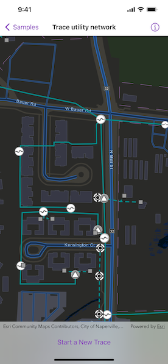

# Trace utility network

Discover connected features in a utility network using connected, subnetwork, upstream, and downstream traces.

## Use case

You can use a trace to visualize and validate the network topology of a utility network for quality assurance. Subnetwork traces are used for validating whether subnetworks, such as circuits or zones, are defined or edited appropriately.

## How to use the sample

Tap "Start a new trace" to select the type of trace using the confirmation dialogue. Tap on one or more features while "Start" or "Barrier" is selected. When a junction feature is identified, you may be prompted to select a terminal. When an edge feature is identified, the distance from the tapped location to the beginning of the edge feature will be computed. Tap "Trace" to initiate a trace on the network. Tap "Reset" to clear the trace parameters and start over.

## How it works

1. Create a `MapView` with a `Map` that contains one more utility networks.
2. Add a `GraphicsOverlay` to hold symbology that distinguishes starting locations from barriers.
3. Add relevant `FeatureLayer`(s) to the map as operation layers, optionally applying custom styling.
4. Allow users to choose a trace type from the set of `UtilityTraceParameters.TraceType`(s).
5. Create `UtilityTraceParameters` with the selected trace type.
6. Set the `UtilityTraceConfiguration` with the utility tier's `defaultTraceConfiguration` property.
7. Use the `onSingleTapGesture` modifier to listen for tap events on the map view.
8. Identify tapped features on the map and add a `Graphic` that represents its purpose (starting point or barrier) at the tapped location.
9. Create a `UtilityElement` for the identified feature.
10. Determine the type of the identified feature using `UtilityNetworkSource.sourceType`.
11. If the type is `junction`, display a terminal picker when more than one terminal is found.
12. If the type is `edge`, compute how far along the edge the user tapped using `GeometryEngine.polyline(_:fractionalLengthClosestTo:tolerance:)`.
13. Add any created `UtilityElement`(s) to the collection of starting locations or barriers in the `UtilityTraceParameters`.
14. Run `UtilityNetwork.trace(using:)` using the `UtilityTraceParameters`.
15. Group the `UtilityElementTraceResult.elements` by their `networkSource.name`.
16. For every `FeatureLayer` in this map with trace result elements, select features by converting `UtilityElement`(s) to `ArcGISFeature`(s) using `UtilityNetwork.features(for:)`.

## Relevant API

* GeometryEngine.polyline(_:fractionalLengthClosestTo:tolerance:)
* ServiceGeodatabase
* UtilityAssetType
* UtilityDomainNetwork
* UtilityElement
* UtilityElementTraceResult
* UtilityNetwork
* UtilityNetworkDefinition
* UtilityNetworkSource
* UtilityTerminal
* UtilityTier
* UtilityTraceConfiguration
* UtilityTraceParameters
* UtilityTraceResult
* UtilityTraceType
* UtilityTraversability

## Additional information

The [Naperville electrical](https://sampleserver7.arcgisonline.com/server/rest/services/UtilityNetwork/NapervilleElectric/FeatureServer) network feature service, hosted on ArcGIS Online, contains a utility network used to run the subnetwork-based trace shown in this sample.

A `UtilityNetworkTrace` toolkit component can be used for various utility network related use cases. For information about setting up the toolkit, as well as code for the underlying component, visit the [toolkit repository](https://github.com/Esri/arcgis-maps-sdk-swift-toolkit).

## Tags

condition barriers, downstream trace, network analysis, subnetwork trace, toolkit, trace configuration, traversability, upstream trace, utility network, validate consistency
