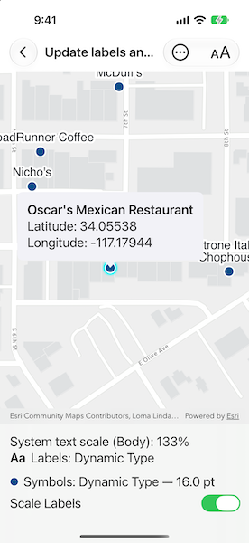

# Update labels and symbols to scale for visual accessibility

Scale feature labels and symbols according to the system text-size setting.

## Use case

Improve map readability for users who increase text size in accessibility settings. Use SwiftUI Dynamic Type to scale restaurant labels and symbols, with independent control over label scaling.

## How to use the sample

Use **Text Size Help** in the toolbar for instructions and an **Open Accessibility Settings** action. On iOS, the action opens **Personal Voice**; navigate back to **Accessibility**, then select **Display & Text Size** > **Larger Text**. No Personal Voice changes are needed. Enable **Larger Accessibility Sizes** for additional sizes, then return to the sample. On Mac Catalyst, navigate to **Accessibility** > **Display** > **Text size**; support depends on the system and app settings. A tip also appears above the map when space and text size permit.

Turn off **Scale Labels** below the map to restore labels to their base size. Symbols continue to follow Dynamic Type. The legend appears below the toggle when space and text size permit. **Text Size Help** provides instructions and an action to open settings. Select a restaurant to show its name and WGS 84 coordinates. Select elsewhere to clear the selection and callout.

## How it works

1. Create a `Map` and add a `FeatureLayer` for the restaurants.
2. Apply a `SimpleMarkerSymbol` using a `SimpleRenderer`.
3. Add a `LabelDefinition` with an `ArcadeLabelExpression` for the name and a `TextSymbol`, enable labels, and load the layer.
4. Use `@ScaledMetric(relativeTo: .body)` to obtain a Dynamic Type scale factor. Observe changes with `onChange(of:initial:_:)`, including the initial value.
5. Multiply the marker's base size and outline width by the scale factor. Scale the label's text symbol only when the label-scaling toggle is enabled. Store these settings in an `@Observable` model.
6. Identify a restaurant with `MapViewProxy.identify(on:screenPoint:tolerance:returnPopupsOnly:maximumResults:)`, and select the feature.
7. Project its location to WGS 84 with `GeometryEngine.project(_:into:)` and show its name and coordinates in a callout. Use semantic fonts so callout text responds to Dynamic Type independently of the label toggle.

## Relevant API

* ArcadeLabelExpression
* FeatureLayer
* GeometryEngine
* LabelDefinition
* MapViewProxy
* SimpleMarkerSymbol
* SimpleRenderer
* TextSymbol

## About the data

This sample uses a [Redlands restaurants](https://www.arcgis.com/home/item.html?id=46119989eccd46a58b8f3d7aedadeb90) feature layer covering food establishments in Redlands, California. Each feature represents a single restaurant.

## Additional information

ArcGIS Maps SDK for Swift 300.1 does not expose WPF's `GeoView.UseSystemTextScale` API. This sample explicitly scales restaurant label text symbols instead; the toggle does not change basemap labels.

Dynamic Type scaling depends on the text style. The displayed percentage is relative to the default Body text size, not a universal operating-system percentage. Label and marker base sizes are 12 points, and the marker outline's base width is 1.5 points. Sizes are always recalculated from these base values to avoid cumulative scaling.

iOS does not provide a public destination for opening Larger Text settings directly. The sample uses `AccessibilitySettings.openSettings(for: .personalVoiceAllowAppsToRequestToUse)`, available on iOS 18 and later, to open a supported Accessibility subpage. Navigate back to Accessibility to reach the text-size settings; the sample does not use Personal Voice. An alert provides manual navigation instructions if opening settings fails. Mac Catalyst continues to use a URL to the Accessibility Display pane. SwiftUI observes text-size changes without a manual notification subscription.

### Layout and behavior checks

Instructions remain available through **Text Size Help** even after dismissing the tip. The floating tip and callout use content sizing rather than fixed or percentage-based dimensions. The tip is omitted when it cannot fit in full; compact-height layouts and accessibility text sizes show only the toggle below the map. Xcode previews cover portrait, short, narrow, and wide layouts, including the largest Dynamic Type size. Previews do not replace on-device checks:

* Record the Xcode version, device or simulator model, OS version, window size or orientation, and Dynamic Type setting for each layout check.
* On iPhone, test portrait and landscape at default and largest accessibility text sizes. Confirm the tip action is fully visible when shown, the toggle is usable, and callout content and help can be scrolled.
* On iPad, repeat in narrow multitasking and full-screen windows. On Mac Catalyst, resize the window and verify pointer interaction and settings guidance.
* Dismiss the tip and reopen help. Return from settings and verify that the displayed scale and symbols update when the system supplies a new text size. With **Scale Labels** off, labels should stay at their base size.
* Select restaurants repeatedly, clear the selection, and rotate or resize with a callout open. Confirm the callout remains usable and stale identify results do not reappear.

The project has no native visionOS target; these previews do not establish behavior for an iPad-compatible app running on Apple Vision Pro.

## Tags

accessibility, dynamic type, label, readability, scale, symbol, text, visual impairment
